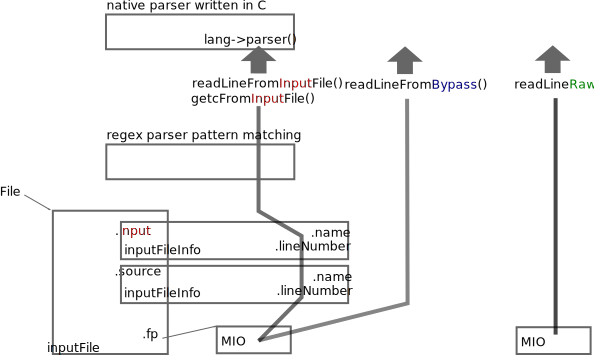
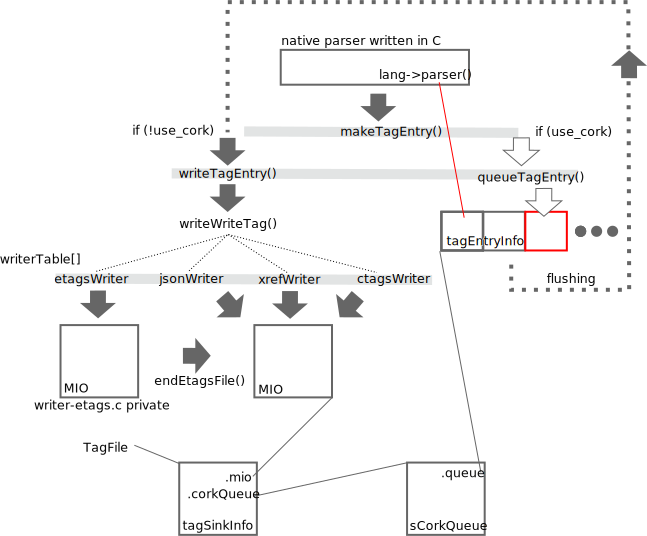
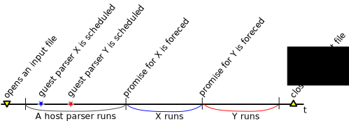

.. ctags Internal API
.. ---------------------------------------------------------------------

.. _input-text-stream:

Input text stream
~~~~~~~~~~~~~~~~~~~~~~~~~~~~~~~~~~~~~~~~~~~~~~~~~~~~~~~~~~~~~~~~~~~~~~

Function prototypes for handling input text stream are declared in
``main/read.h``. The file exists in Exuberant Ctags, too.  However, the
names functions are changed when overhauling ``--line-directive``
option. (In addition macros were converted to functions for making
data structures for the input text stream opaque.)

Ctags has 3 groups of functions for handling input: *input*, *bypass*, and
*raw*. Parser developers should use input group. The rest of two
are for ctags main part.

.. _inputFile:

`inputFile` type and the functions of input group
......................................................................

.. note:: The original version of this section was written
	before ``inputFile`` type and ``File`` variable are made private.

``inputFile`` is the type for representing the input file and stream for
a parser. It was declared in ``main/read.h`` but now it is defined in
``main/read.c``.

Ctags uses a file static variable ``File`` having type ``inputFile`` for
maintaining the input file and stream. ``File`` is also defined in
main/read.c as ``inputFile`` is.

``fp`` and ``line`` are the essential fields of ``File``. ``fp`` having type
well known ``MIO`` declared in ``main/mio.h``. By calling functions of input group
(``getcFromInputFile`` and ``readLineFromInputFile``), a parser gets input
text from ``fp``.

The functions of input group updates fields ``input`` and ``source`` of ``File`` variable.
These two fields has type ``inputFileInfo``. These two fields are for mainly
tracking the name of file and the current line number. Usually ctags uses
only ``input`` field. ``source`` field is used only when ``#line`` directive is found
in the current input text stream.

A case when a tool generates the input file from another file, a tool
can record the original source file to the generated file with using
the ``#line`` directive. ``source`` field is used for tracking/recording the
information appeared on ``#line`` directives.

Regex pattern matching are also done behind calling the functions of
this group.

The functions of bypass group
......................................................................
The functions of bypass group (``readLineFromBypass`` and
``readLineFromBypassSlow``) are used for reading text from ``fp`` field of
``File`` static variable without updating ``input`` and ``source`` fields of
``File`` variable.

Parsers may not need the functions of this group.  The functions are
used in ctags main part. The functions are used to make pattern
fields of tags file, for example.

The functions of raw group
......................................................................
The functions of this group (``readLineRaw`` and ``readLineRawWithNoSeek``)
take a parameter having type ``MIO``; and don't touch ``File`` static
variable.

Parsers may not need the functions of this group.  The functions are
used in ctags main part. The functions are used to load option files,
for example.

.. NOT REVIEWED YET

.. _output-tag-stream:

Output tag stream
~~~~~~~~~~~~~~~~~~~~~~~~~~~~~~~~~~~~~~~~~~~~~~~~~~~~~~~~~~~~~~~~~~~~~~

Ctags provides ``makeTagEntry`` to parsers as an entry point for writing
tag information to MIO. ``makeTagEntry`` calls ``writeTagEntry`` if the
parser does not set ``useCork`` field. ``writeTagEntry`` calls ``writerWriteTag``.
``writerWriteTag`` just calls ``writeEntry`` of writer backends.
``writerTable`` variable holds the four backends: ctagsWriter, etagsWriter,
xrefWriter, and jsonWriter.
One of them is chosen depending on the arguments passed to ctags.

If ``useCork`` is set, the tag information goes to a queue on memory.
The queue is flushed when ``useCork`` in unset. See "`cork API`_" for more
details.

cork API
......................................................................

Background and Idea
^^^^^^^^^^^^^^^^^^^^^^^^^^^^^^^^^^^^^^^^^^^^^^^^^^^^^^^^^^^^^^^^^^^^^^
*cork API* is introduced for recording scope information easier.

Before introducing cork API, a scope information must be recorded as
strings. It is flexible but memory management is required.
Following code is taken from ``clojure.c`` (with some modifications).

.. code-block:: c

		if (vStringLength (parent) > 0)
		{
			current.extensionFields.scope[0] = ClojureKinds[K_NAMESPACE].name;
			current.extensionFields.scope[1] = vStringValue (parent);
		}

		makeTagEntry (&current);

``parent``, ``scope [0]`` and ``scope [1]`` are vStrings. The parser must manage
their life cycles; the parser cannot free them till the tag referring them via
its scope fields are emitted, and must free them after emitting.

cork API provides more solid way to hold scope information. cork API
expects ``parent``, which represents scope of a tag(``current``)
currently parser dealing, is recorded to a *tags* file before recording
the ``current`` tag via ``makeTagEntry`` function.

For passing the information about ``parent`` to ``makeTagEntry``,
``tagEntryInfo`` object was created. It was used just for recording; and
freed after recording.  In cork API, it is not freed after recording;
a parser can reused it as scope information.

How to use
^^^^^^^^^^^^^^^^^^^^^^^^^^^^^^^^^^^^^^^^^^^^^^^^^^^^^^^^^^^^^^^^^^^^^^

See a commit titled with "`clojure: use cork <https://github.com/universal-ctags/ctags/commit/ef181e6>`_".
I applied cork API to the clojure parser.

Cork API can be enabled and disabled per parser,
and is disabled by default. So there is no impact till you
enables it in your parser.

``useCork`` field is introduced in ``parserDefinition`` type:

.. code-block:: c

		typedef struct {
		...
				unsigned int useCork;
		...
		} parserDefinition;

Set ``CORK_QUEUE`` to ``useCork`` like:

.. code-block:: c

    extern parserDefinition *ClojureParser (void)
    {
	    ...
	    parserDefinition *def = parserNew ("Clojure");
	    ...
	    def->useCork = CORK_QUEUE;
	    return def;
    }

When ctags running a parser with ``useCork`` being ``CORK_QUEUE``, all output
requested via ``makeTagEntry`` function calling is stored to an internal
queue, not to ``tags`` file.  When parsing an input file is done, the
tag information stored automatically to the queue are flushed to
``tags`` file in batch.

When calling ``makeTagEntry`` with a ``tagEntryInfo`` object (``parent``),
it returns an integer. The integer can be used as handle for referring
the object after calling.

.. code-block:: c

		static int parent = CORK_NIL;
		...
		parent = makeTagEntry (&e);

The handle can be used by setting to a ``scopeIndex``
field of ``current`` tag, which is in the scope of ``parent``.

.. code-block:: c

		current.extensionFields.scopeIndex = parent;

When passing ``current`` to ``makeTagEntry``, the ``scopeIndex`` is
referred for emitting the scope information of ``current``.

``scopeIndex`` must be set to ``CORK_NIL`` if a tag is not in any scope.
When using ``scopeIndex`` of ``current``, ``NULL`` must be assigned to both
``current.extensionFields.scope[0]`` and
``current.extensionFields.scope[1]``.  ``initTagEntry`` function does this
initialization internally, so you generally you don't have to write
the initialization explicitly.

Automatic full qualified tag generation
^^^^^^^^^^^^^^^^^^^^^^^^^^^^^^^^^^^^^^^^^^^^^^^^^^^^^^^^^^^^^^^^^^^^^^

If a parser uses the cork API for recording and emitting scope
information, ctags can reuse it for generating *full qualified (FQ)
tags*. Set ``requestAutomaticFQTag`` field of ``parserDefinition`` to
``TRUE`` then the main part of ctags emits FQ tags on behalf of the parser
if ``--extras=+q`` is given.

An example can be found in DTS parser:

.. code-block:: c

    extern parserDefinition* DTSParser (void)
    {
	    static const char *const extensions [] = { "dts", "dtsi", NULL };
	    parserDefinition* const def = parserNew ("DTS");
	    ...
	    def->requestAutomaticFQTag = TRUE;
	    return def;
    }

Setting ``requestAutomaticFQTag`` to ``TRUE`` implies setting
``useCork`` to ``CORK_QUEUE``.

.. NOT REVIEWED YET

.. _tokeninfo:

tokenInfo API
~~~~~~~~~~~~~~~~~~~~~~~~~~~~~~~~~~~~~~~~~~~~~~~~~~~~~~~~~~~~~~~~~~~~~~

In Exuberant Ctags, a developer can write a parser anyway; only input
stream and tagEntryInfo data structure is given.

However, while maintaining Universal Ctags I (Masatake YAMATO) think
we should have a framework for writing parser. Of course the framework
is optional; you can still write a parser without the framework.

To design a framework, I have studied how @b4n (Colomban Wendling)
writes parsers. tokenInfo API is the first fruit of my study.

TBW

Multiple parsers
~~~~~~~~~~~~~~~~~~~~~~~~~~~~~~~~~~~~~~~~~~~~~~~~~~~~~~~~~~~~~~~~~~~~~~

.. _promiseAPI:

Guest parser (promise API)
......................................................................

See ":ref:`host-guest-parsers`" about the concept of guest parsers.

Background and Idea
^^^^^^^^^^^^^^^^^^^^^^^^^^^^^^^^^^^^^^^^^^^^^^^^^^^^^^^^^^^^^^^^^^^^^^
More than one programming languages can be used in one input text stream.
*promise API* allows a host parser running a :ref:`guest parser
<host-guest-parsers>` in the specified area of input text stream.

e.g. Code written in c language (C code) is embedded
in code written in Yacc language (Yacc code). Let's think about this
input stream.

.. code-block:: yacc

   /* foo.y */
    %token
	    END_OF_FILE	0
	    ERROR		255
	    BELL		1

    %{
    /* C language */
    int counter;
    %}
    %right	EQUALS
    %left	PLUS MINUS
    ...
    %%
    CfgFile		:	CfgEntryList
			    { InterpretConfigs($1); }
		    ;

    ...
    %%
    int
    yyerror(char *s)
    {
	(void)fprintf(stderr,"%s: line %d of %s\n",s,lineNum,
					    (scanFile?scanFile:"(unknown)"));
	if (scanStr)
	    (void)fprintf(stderr,"last scanned symbol is: %s\n",scanStr);
	return 1;
    }

In the input the area started from ``%{`` to ``%}`` and the area started from
the second ``%%`` to the end of file are written in C. Yacc can be called
*host language*, and C can be called *guest language*.

Ctags may choose the Yacc parser for the input. However, the parser
doesn't know about C syntax. Implementing C parser in the Yacc parser
is one of approach. However, ctags has already C parser.  The Yacc
parser should utilize the existing C parser. The promise API allows this.

See also ":ref:`host-guest-parsers`" about more concept and examples of the
guest parser.

Usage
^^^^^^^^^^^^^^^^^^^^^^^^^^^^^^^^^^^^^^^^^^^^^^^^^^^^^^^^^^^^^^^^^^^^^^

See a commit titled with "`Yacc: run C parser in the areas where code
is written in C <https://github.com/universal-ctags/ctags/commit/757673f>`_".
I applied promise API to the Yacc parser.

The parser for host language must track and record the ``start`` and the
``end`` of a guest language. Pairs of ``line number`` and ``byte offset``
represents the ``start`` and ``end``. When the ``start`` and ``end`` are
fixed, call ``makePromise`` with (1) the guest parser name, (2) ``start``,
and (3) ``end``. (This description is a bit simplified the real usage.)

Let's see the actual code from "`parsers/yacc.c
<https://github.com/universal-ctags/ctags/blob/master/parsers/yacc.c>`_".

.. code-block:: c

	struct cStart {
		unsigned long input;
		unsigned long source;
	};

Both fields are for recording ``start``. ``input`` field
is for recording the value returned from ``getInputLineNumber``.
``source`` is for ``getSourceLineNumber``. See "`inputFile`_" for the
difference of the two.

``enter_c_prologue`` shown in the next is a function called when ``%{`` is
found in the current input text stream. Remember, in yacc syntax, ``%{``
is a marker of C code area.

.. code-block:: c

    static void enter_c_prologue (const char *line CTAGS_ATTR_UNUSED,
				 const regexMatch *matches CTAGS_ATTR_UNUSED,
				 unsigned int count CTAGS_ATTR_UNUSED,
				 void *data)
    {
	   struct cStart *cstart = data;

	   readLineFromInputFile ();
	   cstart->input  = getInputLineNumber ();
	   cstart->source = getSourceLineNumber ();
    }

The function just records the start line.  It calls
``readLineFromInputFile`` because the C code may start the next line of
the line where the marker is.

``leave_c_prologue`` shown in the next is a function called when ``%}``,
the end marker of C code area, is found in the current input text stream.

.. code-block:: c

    static void leave_c_prologue (const char *line CTAGS_ATTR_UNUSED,
				 const regexMatch *matches CTAGS_ATTR_UNUSED,
				 unsigned int count CTAGS_ATTR_UNUSED,
				 void *data)
    {
	   struct cStart *cstart = data;
	   unsigned long c_end;

	   c_end = getInputLineNumber ();
	   makePromise ("C", cstart->input, 0, c_end, 0, cstart->source);
    }

After recording the line number of the end of the C code area,
``leave_c_prologue`` calls ``makePromise``.

Of course ``"C"`` stands for C language, the name of guest parser.
Available parser names can be listed by running ctags with
``--list-languages`` option. In this example two ``0`` characters are provided as
the 3rd and 5th argument. They are byte offsets of the start and the end of the
C language area from the beginning of the line which is 0 in this case. In
general, the guest language's section does not have to start at the beginning of
the line in which case the two offsets have to be provided. Compilers reading
the input character by character can obtain the current offset by calling
``getInputLineOffset()``.

Internal design
^^^^^^^^^^^^^^^^^^^^^^^^^^^^^^^^^^^^^^^^^^^^^^^^^^^^^^^^^^^^^^^^^^^^^^

A host parser cannot run a guest parser directly. What the host parser
can do is just asking the ctags main part scheduling of running the
guest parser for specified area which defined with the ``start`` and
``end``. These scheduling requests are called *promises*.

After running the host parser, before closing the input stream, the
ctags main part checks the existence of promise(s). If there is, the
main part makes a sub input stream and run the guest parser specified
in the promise. The sub input stream is made from the original input
stream by narrowing as requested in the promise. The main part
iterates the above process till there is no promise.

Theoretically a guest parser can be nested; it can make a promise.
The level 2 guest is also just scheduled. (However, I have never
tested such a nested guest parser).

Why not running the guest parser directly from the context of the host
parser? Remember many parsers have their own file static variables. If
a parser is called from the parser, the variables may be crashed.

API for subparser
......................................................................

See ":ref:`base-sub-parsers`" about the concept of subparser.

.. note:: Consider using optlib when implementing a subparser. It is much more
	easy and simple. See ":ref:`defining-subparsers`" for details.

Outline
^^^^^^^^^^^^^^^^^^^^^^^^^^^^^^^^^^^^^^^^^^^^^^^^^^^^^^^^^^^^^^^^^^^^^^

You have to work on both sides: a base parser and subparsers.

A base parser must define a data structure type (``baseMethodTable``) for
its subparsers by extending ``struct subparser`` defined in
``main/subparser.h``.  A subparser defines a variable (``subparser var``)
having type ``baseMethodTable`` by filling its fields and registers
``subparser var`` to the base parser using dependency API.

The base parser calls functions pointed by ``baseMethodTable`` of
subparsers during parsing. A function for probing a higher level
language may be included in ``baseMethodTable``.  What kind of fields
should be included in ``baseMethodTable`` is up to the design of a base
parser and the requirements of its subparsers. A method for
probing is one of them.

Registering a ``subparser var`` to a base parser is enough for the
bottom up choice. For handling the top down choice (e.g. specifying
``--language-force=<subparser>`` in a command line), more code is needed.

In the top down choice, the subparser must call ``scheduleRunningBasepaser``,
declared in ``main/subparser.h``, in its ``parser`` method.
Here, ``parser`` method means a function assigned to the ``parser`` member of
the ``parserDefinition`` of the subparser.
``scheduleRunningBaseparser`` takes an integer argument
that specifies the dependency used for registering the ``subparser var``.

By extending ``struct subparser`` you can define a type for
your subparser. Then make a variable for the type and
declare a dependency on the base parser.

Fields of ``subparser`` type
^^^^^^^^^^^^^^^^^^^^^^^^^^^^^^^^^^^^^^^^^^^^^^^^^^^^^^^^^^^^^^^^^^^^^^

Here the source code of Autoconf/m4 parsers is referred as an example.

``main/types.h``:

.. code-block:: C

    struct sSubparser;
    typedef struct sSubparser subparser;

``main/subparser.h``:

.. code-block:: C

    typedef enum eSubparserRunDirection {
	    SUBPARSER_BASE_RUNS_SUB = 1 << 0,
	    SUBPARSER_SUB_RUNS_BASE = 1 << 1,
	    SUBPARSER_BI_DIRECTION  = SUBPARSER_BASE_RUNS_SUB|SUBPARSER_SUB_RUNS_BASE,
    } subparserRunDirection;

    struct sSubparser {
	    ...

	    /* public to the parser */
	    subparserRunDirection direction;

	    void (* inputStart) (subparser *s);
	    void (* inputEnd) (subparser *s);
	    void (* exclusiveSubparserChosenNotify) (subparser *s, void *data);
    };

A subparser must fill the fields of ``subparser``.

``direction`` field specifies how the subparser is called. See
":ref:`multiple_parsers_directions`" in ":ref:`multiple_parsers`" about
*direction flags*, and see ":ref:`optlib_directions`" in ":ref:`optlib`" for
examples of using the direction flags.

===========================  ======================
``direction`` field          Direction Flag
===========================  ======================
``SUBPARSER_BASE_RUNS_SUB``  ``shared`` (default)
``SUBPARSER_SUB_RUNS_BASE``  ``dedicated``
``SUBPARSER_BI_DIRECTION``   ``bidirectional``
===========================  ======================

If a subparser runs exclusively and is chosen in top down way, set
``SUBPARSER_SUB_RUNS_BASE`` flag. If a subparser runs coexisting way and
is chosen in bottom up way, set ``SUBPARSER_BASE_RUNS_SUB``.  Use
``SUBPARSER_BI_DIRECTION`` if both cases can be considered.

SystemdUnit parser runs as a subparser of iniconf base parser.
SystemdUnit parser specifies ``SUBPARSER_SUB_RUNS_BASE`` because
unit files of systemd have very specific file extensions though
they are written in iniconf syntax. Therefore we expect SystemdUnit
parser is chosen in top down way. The same logic is applicable to
YumRepo parser.

Autoconf parser specifies ``SUBPARSER_BI_DIRECTION``. For input
file having name ``configure.ac``, by pattern matching, Autoconf parser
is chosen in top down way. In other hand, for file name ``foo.m4``,
Autoconf parser can be chosen in bottom up way.

.. TODO: Write about SUBPARSER_BASE_RUNS_SUB after implementing python-celery.

``inputStart`` is called before the base parser starting parsing a new input file.
``inputEnd`` is called after the base parser finishing parsing the input file.
Universal Ctags main part calls these methods. Therefore, a base parser doesn't
have to call them.

``exclusiveSubparserChosenNotify`` is called when a parser is chosen
as an exclusive parser. Calling this method is a job of a base parser.

Extending ``subparser`` type
^^^^^^^^^^^^^^^^^^^^^^^^^^^^^^^^^^^^^^^^^^^^^^^^^^^^^^^^^^^^^^^^^^^^^^

The m4 parser extends ``subparser`` type like following:

``parsers/m4.h``:

.. code-block:: C

    typedef struct sM4Subparser m4Subparser;
    struct sM4Subparser {
	    subparser subparser;

	    bool (* probeLanguage) (m4Subparser *m4, const char* token);

	    /* return value: Cork index */
	    int  (* newMacroNotify) (m4Subparser *m4, const char* token);

	    bool (* doesLineCommentStart)   (m4Subparser *m4, int c, const char *token);
	    bool (* doesStringLiteralStart) (m4Subparser *m4, int c);
    };

Put ``subparser`` as the first member of the extended struct (here sM4Subparser).
In addition the first field, 4 methods are defined in the extended struct.

Till choosing a subparser for the current input file, the m4 parser calls
``probeLanguage`` method of its subparsers each time when find a token
in the input file. A subparser returns ``true`` if it recognizes the
input file is for the itself by analyzing tokens passed from the
base parser.

``parsers/autoconf.c``:

.. code-block:: C

    extern parserDefinition* AutoconfParser (void)
    {
	    static const char *const patterns [] = { "configure.in", NULL };
	    static const char *const extensions [] = { "ac", NULL };
	    parserDefinition* const def = parserNew("Autoconf");

	    static m4Subparser autoconfSubparser = {
		    .subparser = {
			    .direction = SUBPARSER_BI_DIRECTION,
			    .exclusiveSubparserChosenNotify = exclusiveSubparserChosenCallback,
		    },
		    .probeLanguage  = probeLanguage,
		    .newMacroNotify = newMacroCallback,
		    .doesLineCommentStart = doesLineCommentStart,
		    .doesStringLiteralStart = doesStringLiteralStart,
	    };

``probeLanguage`` function defined in ``autoconf.c`` is connected to
the ``probeLanguage`` member of ``autoconfSubparser``. The ``probeLanguage`` function
of Autoconf is very simple:

``parsers/autoconf.c``:

.. code-block:: C

    static bool probeLanguage (m4Subparser *m4, const char* token)
    {
	    return strncmp (token, "m4_", 3) == 0
		    || strncmp (token, "AC_", 3) == 0
		    || strncmp (token, "AM_", 3) == 0
		    || strncmp (token, "AS_", 3) == 0
		    || strncmp (token, "AH_", 3) == 0
		    ;
    }

This function checks the prefix of passed tokens. If known
prefix is found, Autoconf assumes this is an Autoconf input
and returns ``true``.

``parsers/m4.c``:

.. code-block:: C

		if (m4tmp->probeLanguage
			&& m4tmp->probeLanguage (m4tmp, token))
		{
			chooseExclusiveSubparser ((m4Subparser *)tmp, NULL);
			m4found = m4tmp;
		}

The m4 parsers calls ``probeLanguage`` function of a subparser. If ``true``
is returned ``chooseExclusiveSubparser`` function which is defined
in the main part. ``chooseExclusiveSubparser`` calls
``exclusiveSubparserChosenNotify`` method of the chosen subparser.

The method is implemented in Autoconf subparser like following:

``parsers/autoconf.c``:

.. code-block:: C

    static void exclusiveSubparserChosenCallback (subparser *s, void *data)
    {
	    setM4Quotes ('[', ']');
    }

It changes quote characters of the m4 parser.

Making a tag in a subparser
^^^^^^^^^^^^^^^^^^^^^^^^^^^^^^^^^^^^^^^^^^^^^^^^^^^^^^^^^^^^^^^^^^^^^^

Via calling callback functions defined in subparsers, their base parser
gives chance to them making tag entries.

The m4 parser calls ``newMacroNotify`` method when it finds an m4 macro is used.
The Autoconf parser connects ``newMacroCallback`` function defined in ``parser/autoconf.c``.

``parsers/autoconf.c``:

.. code-block:: C

    static int newMacroCallback (m4Subparser *m4, const char* token)
    {
	    int keyword;
	    int index = CORK_NIL;

	    keyword = lookupKeyword (token, getInputLanguage ());

	    /* TODO:
	       AH_VERBATIM
	     */
	    switch (keyword)
	    {
	    case KEYWORD_NONE:
		    break;
	    case KEYWORD_init:
		    index = makeAutoconfTag (PACKAGE_KIND);
		    break;

    ...

    extern parserDefinition* AutoconfParser (void)
    {
	    ...
	    static m4Subparser autoconfSubparser = {
		    .subparser = {
			    .direction = SUBPARSER_BI_DIRECTION,
			    .exclusiveSubparserChosenNotify = exclusiveSubparserChosenCallback,
		    },
		    .probeLanguage  = probeLanguage,
		    .newMacroNotify = newMacroCallback,

In ``newMacroCallback`` function, the Autoconf parser receives the name of macro
found by the base parser and analysis whether the macro is interesting
in the context of Autoconf language or not. If it is interesting name,
the Autoconf parser makes a tag for it.

Calling methods of subparsers from a base parser
^^^^^^^^^^^^^^^^^^^^^^^^^^^^^^^^^^^^^^^^^^^^^^^^^^^^^^^^^^^^^^^^^^^^^^

A base parser can use ``foreachSubparser`` macro for accessing its
subparsers. A base should call ``enterSubparser`` before calling a
method of a subparser, and call ``leaveSubparser`` after calling the
method. The macro and functions are declare in ``main/subparser.h`` .

``parsers/m4.c``:

.. code-block:: C

    static m4Subparser * maySwitchLanguage (const char* token)
    {
	    subparser *tmp;
	    m4Subparser *m4found = NULL;

	    foreachSubparser (tmp, false)
	    {
		    m4Subparser *m4tmp = (m4Subparser *)tmp;

		    enterSubparser(tmp);
		    if (m4tmp->probeLanguage
			    && m4tmp->probeLanguage (m4tmp, token))
		    {
			    chooseExclusiveSubparser (tmp, NULL);
			    m4found = m4tmp;
		    }
		    leaveSubparser();

		    if (m4found)
			    break;
	    }

	    return m4found;
    }

``foreachSubparser`` takes a variable having type ``subparser``.
For each iteration, the value for the variable is updated.

``enterSubparser`` takes a variable having type ``subparser``.  With the
calling ``enterSubparser``, the current language (the value returned from
``getInputLanguage``) can be temporary switched to the language specified
with the variable. One of the effect of switching is that ``language``
field of tags made in the callback function called between
``enterSubparser`` and ``leaveSubparser`` is adjusted.

Registering a subparser to its base parser
^^^^^^^^^^^^^^^^^^^^^^^^^^^^^^^^^^^^^^^^^^^^^^^^^^^^^^^^^^^^^^^^^^^^^^

Use ``DEPTYPE_SUBPARSER`` dependency in a subparser for registration.

``parsers/autoconf.c``:

.. code-block:: C

    extern parserDefinition* AutoconfParser (void)
    {
	    parserDefinition* const def = parserNew("Autoconf");

	    static m4Subparser autoconfSubparser = {
		    .subparser = {
			    .direction = SUBPARSER_BI_DIRECTION,
			    .exclusiveSubparserChosenNotify = exclusiveSubparserChosenCallback,
		    },
		    .probeLanguage  = probeLanguage,
		    .newMacroNotify = newMacroCallback,
		    .doesLineCommentStart = doesLineCommentStart,
		    .doesStringLiteralStart = doesStringLiteralStart,
	    };
	    static parserDependency dependencies [] = {
		    [0] = { DEPTYPE_SUBPARSER, "M4", &autoconfSubparser },
	    };

	    def->dependencies = dependencies;
	    def->dependencyCount = ARRAY_SIZE (dependencies);

``DEPTYPE_SUBPARSER`` is specified in the 0th element of ``dependencies``
function static variable. In the next a literal string "M4" is
specified and ``autoconfSubparser`` follows. The intent of the code is
registering ``autoconfSubparser`` subparser definition to a base parser
named "M4".

``dependencies`` function static variable must be assigned to
``dependencies`` fields of a variable of ``parserDefinition``.
The main part of Universal Ctags refers the field when
initializing parsers.

``[0]`` emphasizes this is "the 0th element". The subparser may refer
the index of the array when the subparser calls
``scheduleRunningBaseparser``.

Scheduling running the base parser
^^^^^^^^^^^^^^^^^^^^^^^^^^^^^^^^^^^^^^^^^^^^^^^^^^^^^^^^^^^^^^^^^^^^^^

For the case that a subparser is chosen in top down, the subparser
must call ``scheduleRunningBaseparser`` in the main ``parser`` method.

``parsers/autoconf.c``:

.. code-block:: C

    static void findAutoconfTags(void)
    {
	    scheduleRunningBaseparser (0);
    }

    extern parserDefinition* AutoconfParser (void)
    {
	    ...
	    parserDefinition* const def = parserNew("Autoconf");
	    ...
	    static parserDependency dependencies [] = {
		    [0] = { DEPTYPE_SUBPARSER, "M4", &autoconfSubparser },
	    };

	    def->dependencies = dependencies;
	    ...
	    def->parser = findAutoconfTags;
	    ...
	    return def;
    }

A subparser can do nothing actively. A base parser makes its subparser
work by calling methods of the subparser.  Therefore a subparser must
run its base parser when the subparser is chosen in a top down way,
The main part prepares ``scheduleRunningBaseparser`` function for the purpose.

A subparser should call the function from ``parser`` method of ``parserDefinition``
of the subparser. ``scheduleRunningBaseparser`` takes an integer. It specifies
an index of the dependency which is used for registering the subparser.

PackCC compiler-compiler
~~~~~~~~~~~~~~~~~~~~~~~~~~~~~~~~~~~~~~~~~~~~~~~~~~~~~~~~~~~~~~~~~~~~~~

PackCC is a compiler-compiler; it translates ``.peg`` grammar file to ``.c``
file.  PackCC was originally written by Arihiro Yoshida. Its source
repository is at https://github.com/arithy/packcc.

The source tree of PackCC is grafted at ``misc/packcc`` directory.
Building PackCC and ctags are integrated in the build-scripts of
Universal Ctags.

Refer `peg/valink.peg
<https://github.com/universal-ctags/ctags/blob/master/peg/varlink.peg>`_ as a
sample of a parser using PackCC.

Automatic parser guessing (TBW)
~~~~~~~~~~~~~~~~~~~~~~~~~~~~~~~~~~~~~~~~~~~~~~~~~~~~~~~~~~~~~~~~~~~~~~

Managing regular expression parsers (TBW)
~~~~~~~~~~~~~~~~~~~~~~~~~~~~~~~~~~~~~~~~~~~~~~~~~~~~~~~~~~~~~~~~~~~~~~

Ghost kind in regex parser (TBW)
~~~~~~~~~~~~~~~~~~~~~~~~~~~~~~~~~~~~~~~~~~~~~~~~~~~~~~~~~~~~~~~~~~~~~~

.. TODO: Q: what is the point of documenting this?
	from comment on #2916: I (@masatake) must explain the ghost kind.
	from comment on #2916:
		I (@masatake) found I must explain "placeholder tag". The ghost kind is
		useful for fill the find field of the placeholder tag. I will write about
		the Ghost kind when I write about the placeholder tag. I will write about
		the placeholder tag when I write about Optscript.

	If a whitespace is used as a kind letter, it is never printed when
	ctags is called with ``--list-kinds`` option.  This kind is
	automatically assigned to an empty name pattern.

	Normally you don't need to know this.
