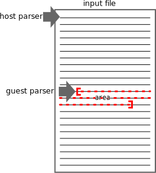

.. NOT REVIEWED YET

.. _multiple_parsers:

Running multiple parsers on an input file
---------------------------------------------------------------------

Universal Ctags provides parser developers two ways, *guest parser* (guest/host)
and *subparser* (sub/base), to run multiple parsers for an input file.

This section shows concepts behind the running multiple parsers and real
examples.

.. _host-guest-parsers:

Guest parser: Applying a parser to specified areas of input file
~~~~~~~~~~~~~~~~~~~~~~~~~~~~~~~~~~~~~~~~~~~~~~~~~~~~~~~~~~~~~~~~~~~~~~

*Guest parser* (guest/host) considers the case that an input file has areas
written in languages different from the language for the input file.

A *host parser* parses the input file and detects the areas.
The host parser schedules *guest parsers* parsing the areas.
The guest parsers parse the areas.

.. NOTE: We don't have --list-guest-parser option as --list-subparser for
	a subparser, because a guest parser does not define a new parser and it just
	uses parsers which are already defined.

Command line interface
.........................................................................

Running guest parser can be controlled with guest (``g``) extras flag.
By default it is disabled. To turning on the feature running
guest parser, specify ``--extras=+g``.

If ``--fields=+E`` is given, all tags generated by a guest parser is marked
``guest`` in their ``extras:`` fields.

Examples of guest parser
......................................................................

{CSS,JavaScript}/HTML parser combination
,,,,,,,,,,,,,,,,,,,,,,,,,,,,,,,,,,,,,,,,,,,,,,,,,,,,,,,,,,,,,,,,,,,,,,,

For an HTML file, you may want to run HTML parser, of course. The
HTML file may have CSS areas and JavaScript areas. In other hand
Universal Ctags has both CSS and JavaScript parsers. Don't you
think it is useful if you can apply these parsers to the areas?

In this case, HTML has responsible to detect the CSS and
JavaScript areas and record the positions of the areas.
The HTML parser schedules delayed invocations of CSS and
JavaScript parsers on the area with promise API.

Here HTML parser is a *host parser*. CSS and JavaScript parsers
are *guest parsers*.

See ":ref:`The new HTML parser <html>`" and "`parsers/html.c
<https://github.com/universal-ctags/ctags/blob/master/parsers/html.c>`_".

C/Yacc parser combination
,,,,,,,,,,,,,,,,,,,,,,,,,,,,,,,,,,,,,,,,,,,,,,,,,,,,,,,,,,,,,,,,,,,,,,,

A yacc file has some areas written in C. Universal Ctags has both YACC
and C parsers. You may want to run C parser for the areas from YACC
parser.

Here YACC parser is a host parser. C parser is a guest parser.
See "`parsers/yacc.c
<https://github.com/universal-ctags/ctags/blob/master/parsers/yacc.c>`_".

Pod/Perl parser combination
,,,,,,,,,,,,,,,,,,,,,,,,,,,,,,,,,,,,,,,,,,,,,,,,,,,,,,,,,,,,,,,,,,,,,,,

Pod (Plain Old Documentation) is a language for documentation.  The language
can be used not only in a stand alone file but also it can be
used inside a Perl script.

Universal Ctags has both parsers for Perl and Pod.
The Perl parser recognizes the area where Pod document is
embedded in a Perl script and schedules applying pod parser
as a guest parser on the area.

.. _base-sub-parsers:

Subparser: Tagging definitions of higher (upper) level language
~~~~~~~~~~~~~~~~~~~~~~~~~~~~~~~~~~~~~~~~~~~~~~~~~~~~~~~~~~~~~~~~~~~~~~

Background
......................................................................

Consider an application written in language X.  The application has
its domain own concepts. Developers of the application may try to
express the concepts in the syntax of language X.

In language X level, the developer can define functions, variables, types, and
so on. Further more, if the syntax of X allows, the developers want to
define higher level (= application level) things for implementing the
domain own concepts.

Let me show the part of source code of SPY-WARS, an imaginary game application.
It is written in scheme language, a dialect of lisp.
(Here `gauche <https://practical-scheme.net/gauche/index.html>`_ is considered
as the implementation of scheme interpreter).

.. code-block:: scheme

    (define agent-tables (make-hash-table))
    (define-class <agent> ()
      ((rights :init-keyword :rights)
       (responsibilities :init-keyword :responsibilities)))

    (define-macro (define-agent name rights responsibilities)
      `(hash-table-put! agent-tables ',name
			(make <agent>
			  :rights ',rights
			  :responsibilities ',responsibilities)))

    (define-agent Bond (kill ...) ...)
    (define-agent Bourne ...)

    ...

``define``, ``define-class``, and ``define-macro`` are keywords of scheme
for defining a variable, class and macro. Therefore scheme parser of
ctags should make tags for ``agent-tables`` with variable kind,
``<agent>`` with class kind, and ``define-agent`` with macro kind.
There is no discussion here.

    NOTE: To be exactly ``define-class`` and ``define-macro`` are not the part
    of scheme language. They are part of gauche. That means three parsers
    are stacked: scheme, gosh, and SPY-WARS.

The interesting things here are ``Bond`` and ``Bourne``.

.. code-block:: scheme

    (define-agent Bond (kill ...) ...)
    (define-agent Bourne ...)

In scheme parser level, the two expressions define nothing; the two
expressions are just macro (``define-agent``) expansions.

However, in the application level, they define agents as the
macro name shown. In this level Universal Ctags should capture
``Bond`` and ``Bourne``. The question is which parser should
capture them?  scheme parser should not; define-agent is not part of
scheme language. Newly defined SPY-WARS parser is the answer.

Though ``define-agent`` is just a macro in scheme parser level,
it is keyword in SPY-WARS parser. SPY-WARS parser makes a
tag for a token next to ``define-agent``.

The above example illustrates levels of language in an input
file. scheme is used as the base language. With the base language we
can assume an imaginary higher level language named SPY-WARS is used
to write the application. To parse the source code of the application
written in two stacked language, ctags uses the two stacked parsers.

Making higher level language is very popular technique in the
languages of lisp family (see "`On Lisp
<http://www.paulgraham.com/onlisp.html>`_" for more details).
However, it is not special to lisp.

Following code is taken from linux kernel written in C:

.. code-block:: C

    DEFINE_EVENT(mac80211_msg_event, mac80211_info,
	    TP_PROTO(struct va_format *vaf),
	    TP_ARGS(vaf)
    );

There is no concept EVENT in C language, however it make sense in the
source tree of linux kernel. So we can consider linux parser, based on
C parser, which tags ``mac80211_msg_event`` as ``event`` kind.

Terms
......................................................................

Base parser and subparser
,,,,,,,,,,,,,,,,,,,,,,,,,,,,,,,,,,,,,,,,,,,,,,,,,,,,,,,,,,,,,,,,,,,,,,,
In the context of the SPY-WARS example, scheme parser is called a *base
parser*. The SPY-WARS is called a *subparser*. A base parser tags
definitions found in lower level view. A subparser on the base parser tags
definitions found in higher level view. This relationship can be nested.
A subparser can be a base parser for another subparser.

.. figure:: stack-and-parsers.svg
	    :scale: 80%

At a glance the relationship between two parsers are similar to the
relationship guest parser and host parser description in
":ref:`host-guest-parsers`".
However, they are different. Though a guest
parser can run stand-alone, a subparser cannot; a subparser needs help
from base parser to work.

Top down parser choice and bottom up parser choice
,,,,,,,,,,,,,,,,,,,,,,,,,,,,,,,,,,,,,,,,,,,,,,,,,,,,,,,,,,,,,,,,,,,,,,,

There are two ways to run a subparser: *top down* or *bottom up* parser
choices.

Universal Ctags can chose a subparser :ref:`automatically <guessing>`.
Matching file name patterns and extensions are the typical ways for
choosing. A user can choose a subparser with ``--language-force=`` option.
Choosing a parser in these deterministic way is called *top down*.
When a parser is chosen as a subparser in the top down way, the
subparser must call its base parser. The base parser may call methods
defined in the subparser.

Universal Ctags uses *bottom up* choice when the top down way
doesn't work; a given file name doesn't match any patterns and
extensions of subparsers and the user doesn't specify
``--language-force=`` explicitly. In choosing a subparser bottom up way
it is assumed that a base parser for the subparser can be chosen
by top down way. During a base parser running, the base parser tries
to detect use of higher level languages in the input file. As shown
later in this section, the base parser utilizes methods defined in its
subparsers for the detection. If the base parser detects the use of a
higher level language, a subparser for the higher level language is
chosen.  Choosing a parser in this non-deterministic way (dynamic way)
is called *bottom up*.

============================== =================
input file                     subparser choices
============================== =================
*<SUB_LANG>*  (``input.sub``)  top down
*<BASE_LANG>* (``input.base``) bottom up
============================== =================

Here is an example. Universal Ctags has both m4 parser and Autoconf
parser.  The m4 parser is a base parser. The Autoconf parser is a
subparser based on the m4 parser. If ``configure.ac`` is given as an
input file, Autoconf parser is chosen automatically because the
Autoconf parser has ``configure.ac`` in its patterns list. Based on the
pattern matching, Universal Ctags chooses the Autoconf parser
automatically (top down choice).

If ``input.m4`` is given as an input file, the Autoconf parser is
not chosen. Instead the m4 parser is chosen automatically because
the m4 parser has ``.m4`` in its extension list. The m4 parser passes
every token finding in the input file to the
Autoconf parser. The Autoconf parser gets the chance to probe
whether the Autoconf parser itself can handle the input or not; if
a token name is started with ``AC_``, the Autoconf parser
reports "this is Autoconf input though its file extension
is ``.m4``" to the m4 parser. As the result the Autoconf parser is
chosen (bottom up choice).

Some subparsers can be chosen both top down and bottom up ways. Some
subparser can be chosen only top down way or bottom up ways.

.. _multiple_parsers_directions:

Direction flags
,,,,,,,,,,,,,,,,,,,,,,,,,,,,,,,,,,,,,,,,,,,,,,,,,,,,,,,,,,,,,,,,,,,,,,,

.. TESTCASE: Units/flags-langdef-directions.r

*Direction flags* specify how a base parser and a subparser work together. You
can choose directions by putting a long flag after
``--langdef=<SUB_LANG>{base=<BASE_LANG>}``.

The following three direction flags are available;

``shared`` (default):
	For an input file of *<BASE_LANG>* (ex. ``input.base``), tags captured by
	both *<BASE_LANG>* and *<SUB_LANG>* parser are recorded to tags file.

	For an input file of *<SUB_LANG>* (ex. ``input.sub``), tags captured by only
	*<SUB_LANG>* parser are recorded to tags file.

	=============== ===================== ======================
	input file      tags of *<BASE_LANG>* tags of *<SUB_LANG>*
	=============== ===================== ======================
	``input.base``  recorded              recorded
	``input.sub``   ---                   recorded
	=============== ===================== ======================

``dedicated``:
	For an input file of *<BASE_LANG>* (ex. ``input.base``), tags captured by
	only *<BASE_LANG>* parser are recorded to tags file.

	For an input file of *<SUB_LANG>* (ex. ``input.sub``), tags captured by both
	*<BASE_LANG>* and *<SUB_LANG>* parser are recorded to tags file.

	=============== ===================== ======================
	input file      tags of *<BASE_LANG>* tags of *<SUB_LANG>*
	=============== ===================== ======================
	``input.base``  recorded              ---
	``input.sub``   recorded              recorded
	=============== ===================== ======================

``bidirectional``:
	For an input file of both *<BASE_LANG>* (ex. ``input.base``) and
	*<SUB_LANG>* (ex. ``input.sub``), tags captured by both *<BASE_LANG>* and
	<SUB_LANG> parser are recorded to tags file.

	=============== ===================== ======================
	input file      tags of *<BASE_LANG>* tags of *<SUB_LANG>*
	=============== ===================== ======================
	``input.base``  recorded              recorded
	``input.sub``   recorded              recorded
	=============== ===================== ======================

If no direction flag is specified, it implies ``{shared}``.

See ":ref:`optlib_directions`" in ":ref:`optlib`" for examples of using the
direction flags.

Listing subparsers
.........................................................................
Subparsers can be listed with ``--list-subparser``:

.. code-block:: console

    $ ctags --options=./linux.ctags --list-subparsers=C
    #NAME                          BASEPARSER           DIRECTION
    linux                          C                    base => sub {shared}

Command line interface
.........................................................................

Running subparser can be controlled with subparser (``s``) extras flag.
By default it is enabled. To turning off the feature running
subparser, specify ``--extras=-s``.

Examples of subparser
......................................................................

Automake/Make parser combination
,,,,,,,,,,,,,,,,,,,,,,,,,,,,,,,,,,,,,,,,,,,,,,,,,,,,,,,,,,,,,,,,,,,,,,,

Simply to say the syntax of Automake is the subset of Make.  However,
the Automake parser has interests in Make macros having special
suffixes: ``_PROGRAMS``, ``_LTLIBRARIES``, and ``_SCRIPTS`` so on.

Here is an example of input for Automake:

.. code-block:: Make

    bin_PROGRAMS = ctags
    ctags_CPPFLAGS =    \
	    -I.         \
	    -I$(srcdir) \
	    -I$(srcdir)/main

From the point of the view of the Make parser, ``bin_PROGRAMS`` is a just
a macro; the Make parser tags ``bin_PROGRAMS`` as a macro. The Make parser
doesn't tag ``ctags`` being right side of '``=``' because it is not a new
name: just a value assigned to bin_PROGRAMS. However, for the Automake
parser ``ctags`` is a new name; the Automake parser tags ``ctags`` with
kind ``Program``. The Automake parser can tag it with getting help from
the Make parser.

The Automake parser is an exclusive subparser. It is chosen in top
down way; an input file name ``Makefile.am`` gives enough information for
choosing the Automake parser.

To give chances to the Automake parser to capture Automake own
definitions, The Make parser provides following interface in
``parsers/make.h``:

.. code-block:: C

    struct sMakeSubparser {
	    subparser subparser;

	    void (* valueNotify) (makeSubparser *s, char* name);
	    void (* directiveNotify) (makeSubparser *s, char* name);
	    void (* newMacroNotify) (makeSubparser *s,
				     char* name,
				     bool withDefineDirective,
				     bool appending);
    };

The Automake parser defines methods for tagging Automake own definitions
in a ``struct sMakeSubparser`` type variable, and runs the Make parser by
calling ``scheduleRunningBaseparser`` function.

The Make parser tags Make own definitions in an input file.  In
addition Make parser calls the methods during parsing the input file.

.. code-block:: console

   $ ctags --fields=+lK  --extras=+r -o - Makefile.am
   bin	Makefile.am	/^bin_PROGRAMS = ctags$/;"	directory	language:Automake
   bin_PROGRAMS	Makefile.am	/^bin_PROGRAMS = ctags$/;"	macro	language:Make
   ctags	Makefile.am	/^bin_PROGRAMS = ctags$/;"	program	language:Automake	directory:bin
   ctags_CPPFLAGS	Makefile.am	/^ctags_CPPFLAGS =    \\$/;"	macro	language:Make

``bin_PROGRAMS`` and ``ctags_CPPFLAGS`` are tagged as macros of Make.
In addition ``bin`` is tagged as directory, and ``ctags`` as program of Automake.

``bin`` is tagged in a callback function assigned to ``newMacroFound`` method.
``ctags`` is tagged in a callback function assigned to ``valuesFound`` method.

``--extras=+r`` is used in the example. Reference (``r``) extra is needed to
tag ``bin``. ``bin`` is not defined in the line, ``bin_PROGRAMS =``.
``bin`` is referenced as a name of directory where programs are
stored. Therefore ``r`` is needed.

For tagging ``ctags``, the Automake parser must recognize
``bin`` in ``bin_PROGRAMS`` first. ``ctags`` is tagged
because it is specified as a value for ``bin_PROGRAMS``.
As the result ``r`` is also needed to tag ``ctags``.

Only Automake related tags are emitted if Make parser is
disabled.

.. code-block:: console

	$ ctags --languages=-Make --fields=+lKr --extras=+r -o - Makefile.am
	bin	Makefile.am	/^bin_PROGRAMS = ctags$/;"	directory	language:Automake	roles:program
	ctags	Makefile.am	/^bin_PROGRAMS = ctags$/;"	program	language:Automake	directory:bin

Autoconf/M4 parser combination
,,,,,,,,,,,,,,,,,,,,,,,,,,,,,,,,,,,,,,,,,,,,,,,,,,,,,,,,,,,,,,,,,,,,,,,

Universal Ctags uses m4 parser as a base parser and Autoconf parse as
a subparser for ``configure.ac`` input file.

.. code-block:: Autoconf

   AC_DEFUN([PRETTY_VAR_EXPAND],
	     [$(eval "$as_echo_n" $(eval "$as_echo_n" "${$1}"))])

The m4 parser finds no definition here.  However, Autoconf parser finds
``PRETTY_VAR_EXPAND`` as a macro definition. Syntax like ``(...)`` is part
of M4 language. So Autoconf parser is implemented as a subparser of
m4 parser. The most parts of tokens in input files are handled by
M4. Autoconf parser gives hints for parsing ``configure.ac`` and
registers callback functions to
Autoconf parser.
